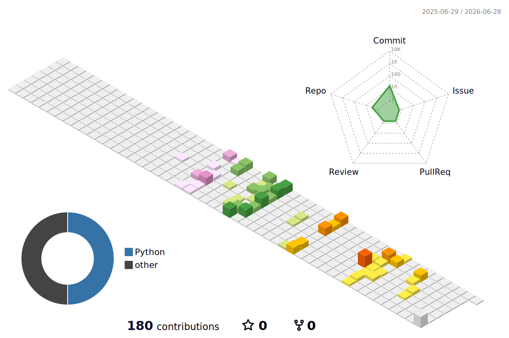

<!-- Header -->

  

<!-- Intro -->
<h2 align="center">Building robotic systems from perception to control</h2>

  RGB-D Vision · Robotic Grasping · ROS 2 · MoveIt 2 · Embedded Control

 

<!-- Tech Stack -->
<h3 align="center">Tech Stack</h3>

  

 

<!-- Focus -->
<h3 align="center">Current Focus</h3>

  Developing robotic manipulation systems with RGB-D perception, motion planning, and ROS 2 integration.

 

<!-- Projects -->
<h3 align="center">Featured Projects</h3>

  

 

<!-- Contribution Graph -->

  

<!-- Footer -->

  

